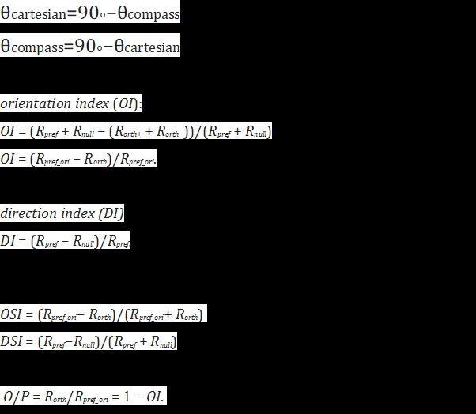

θcartesian=90∘−θcompass
θcompass=90∘−θcartesian

orientation index (OI):
OI = (Rpref + Rnull − (Rorth+ + Rorth−))/(Rpref + Rnull)
OI = (Rpref_ori − Rorth)/Rpref_ori.

direction index (DI)
DI = (Rpref − Rnull)/Rpref.

OSI = (Rpref_ori− Rorth)/(Rpref_ori+ Rorth) 
DSI = (Rpref−Rnull)/(Rpref + Rnull)

O/P = Rorth/Rpref_ori = 1 − OI. 

